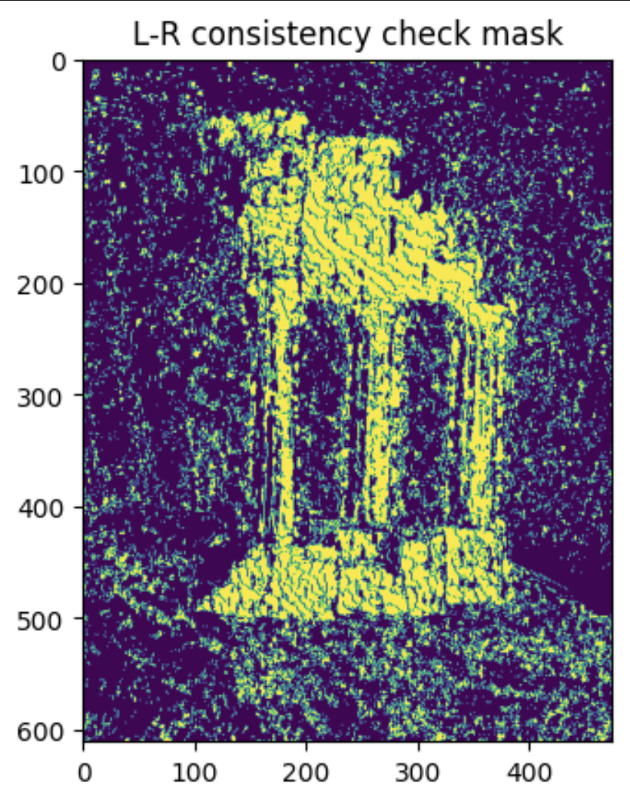

# 3D Scene Reconstruction Pipeline

The entire pipeline is composed of various parts.

## 1) Using Optical Flow to get Point Correspondences and estimate Depths.

Optical flow is computed over a small window. The smallest singular value of spatiotemporal derivative matrix is calculated and the pixels above a certain threshold value are considered. 

### **Flow Vectors:**  

### **Epipoles after RANSAC and satisfying planar condition equation by a threshold:**   

### **Depths are then calculated by assuming pure translational motion:**   

 

## 2) Reconstruction of 3D scene from 2 views using 2-view SFM

### **Feature identification using SIFT**:

### **Key point matching using Least Squares and RANSAC**:

### **Resulting Epipolar lines**:

### **Reprojection of points of one image onto the other**:

 

## 3) Recreate 3D Model from multi-view SFM

### **Input views**:  

### **Disparity**:  

### **Disparity and depth after post processing**:  

### **L-R Consistency check mask**:  

Reconstructed 3d model from 2 views using ZNCC Kernel -

Entire Reconstructed 3d model
